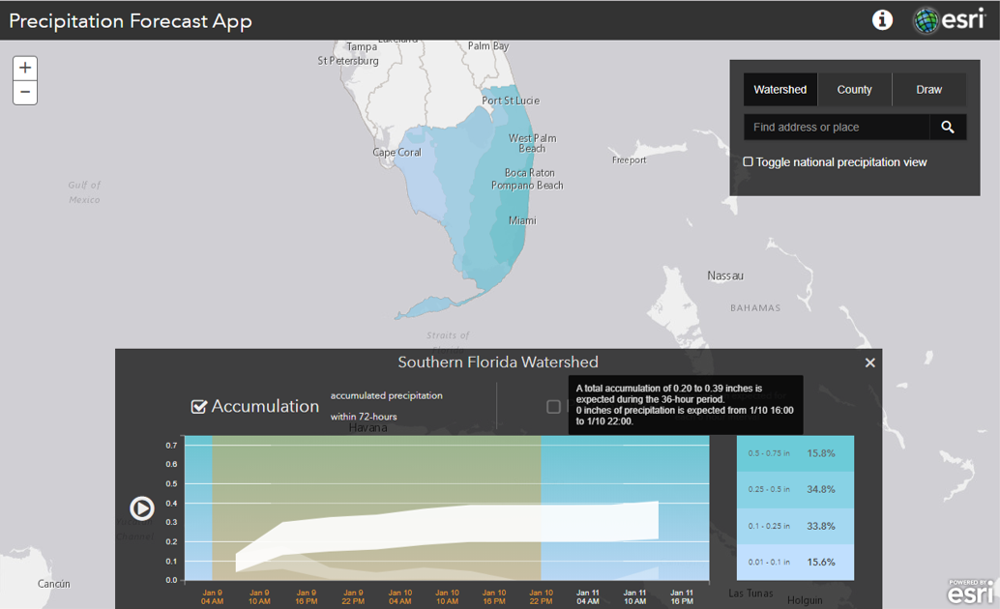

# Precipitation App

The [Precipitation App](https://livingatlasdev.arcgis.com/precipitation/) provides users an interactive way to visualize a mapped forecast of the precipitation for the next 72 hours for any location across the Continental United States. The Precipitation Forecast Live Feeds data used by this application are updated hourly from the National Digital Forecast Database (NDFD) produced by the National Weather Service. 

[View it live](https://livingatlasdev.arcgis.com/precipitation/)

## Features

## Instructions

1. Fork and then clone the repo. 
2. Navigate to the home directory of the repo on your local machine with the web server running and view the app.

## Requirements

- [ArcGIS API for JavaScript (version 3.16)](https://developers.arcgis.com/javascript/index.html)
- [D3.js (version 3)](https://d3js.org/)
- [jQuery](http://jquery.com/)
- [Underscroe.js](http://underscorejs.org/)

## Resources
* The Precipitation Forecast Live Feeds data are avialble on [Living Atlas of the World](https://livingatlas.arcgis.com/en/#s=0&q=Precipitation%20Forecast).
* [The National Digital Forecast Database](https://www.weather.gov/mdl/ndfd_home)

## Issues

Find a bug or want to request a new feature?  Please let us know by submitting an issue.

## Contributing

Esri welcomes contributions from anyone and everyone. Please see our [guidelines for contributing](https://github.com/esri/contributing).

## Licensing
Copyright 2016 Esri

Licensed under the Apache License, Version 2.0 (the "License");
you may not use this file except in compliance with the License.
You may obtain a copy of the License at

   http://www.apache.org/licenses/LICENSE-2.0

Unless required by applicable law or agreed to in writing, software
distributed under the License is distributed on an "AS IS" BASIS,
WITHOUT WARRANTIES OR CONDITIONS OF ANY KIND, either express or implied.
See the License for the specific language governing permissions and
limitations under the License.

A copy of the license is available in the repository's [license.txt](license.txt) file.